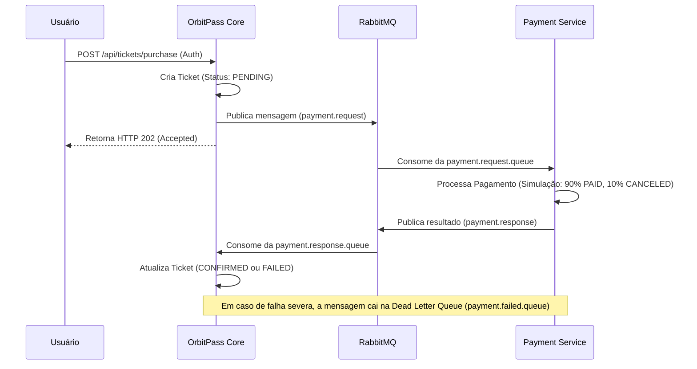

# OrbitPass - Plataforma de Turismo Espacial

**OrbitPass** é uma plataforma inovadora baseada em microserviços desenvolvida em Java e Spring Boot para reserva e pagamento de viagens de turismo espacial para três destinos exclusivos: **Lua**, **Marte** e **Órbita Terrestre**. 

O sistema integra conceitos modernos de engenharia de software, incluindo mensageria assíncrona com RabbitMQ, banco de dados vetorial com PgVector, inteligência artificial generativa com Spring AI (Google Gemini) para suporte ao cliente (RAG), cache distribuído de dados de viagens, e segurança robusta via Spring Security com autenticação JWT.

---

## 🛠️ Arquitetura do Projeto

A aplicação é dividida em dois microserviços principais:

1. **`orbitpass-core` (Porta `8080`)**:
   - Gerencia o fluxo de cadastro e login de usuários.
   - Gerencia passeios (Tours) e datas de voos (Tour Dates).
   - Gerencia as reservas de passagens (Tickets).
   - Armazena a base de conhecimento sobre destinos espaciais e executa o chatbot assistente utilizando Inteligência Artificial (RAG) integrada a um banco vetorial no PostgreSQL (`pgvector`).
   
2. **`orbitpass-payment-service` (Porta `8081`)**:
   - Serviço reativo e assíncrono para processamento de pagamentos.
   - Ouve as solicitações de pagamento via RabbitMQ, processa-as simulando uma taxa de sucesso de 90%, e publica a resposta de volta no barramento.

---

## 🚀 Fluxos de Negócio Principais

### 1. Compra de Passagem & Processamento de Pagamento (Mensageria)



### 2. Assistente Virtual com IA (RAG - Retrieval-Augmented Generation)
A plataforma possui um assistente de IA especializado em viagens espaciais para ajudar passageiros sobre destinos e suas restrições médicas:
- **Alimentação da Base (Seeding)**: Um endpoint administrativo (`POST /api/vector-store/seed`) lê um catálogo detalhado de destinos (`destinations.json`), gera os embeddings vetoriais (vetor de 768 dimensões gerado via Gemini) e os armazena na tabela de vetores `vector_store` no PostgreSQL.
- **Chat Interativo (`POST /api/vector-store/chat`)**: O usuário envia uma mensagem. O sistema gera o embedding da pergunta, faz uma busca por similaridade de cosseno (Cosine Distance) no PostgreSQL para recuperar trechos relevantes sobre o destino, injeta esses trechos como contexto no prompt do LLM e solicita a resposta ao modelo Google Gemini (padrão `gemini-3.5-flash`).

---

## 💻 Tecnologias Utilizadas

- **Linguagem**: Java 21
- **Framework Principal**: Spring Boot 3.5.14
- **Persistência**: Spring Data JPA & PostgreSQL + PgVector (imagem `pgvector/pgvector:pg16`)
- **Mensageria**: RabbitMQ (Spring Boot AMQP) com fila de Dead Letters (DLQ)
- **Inteligência Artificial**: Spring AI (Google GenAI Starter & Embeddings)
- **Segurança**: Spring Security & Auth0 Java JWT 4.4.0
- **Documentação de APIs**: Springdoc OpenAPI / Swagger UI 2.8.5
- **Migrações de DB**: Flyway Migration
- **Comunicação interna & Resiliência**: Spring Cloud OpenFeign & Circuit Breaker (Resilience4j)
- **Melhorias e Boas Práticas**: Lombok, Spring HATEOAS, Caching de dados de Tours (`@Cacheable`).

---

## ⚙️ Configuração do Ambiente

### 1. Pré-requisitos
- **Java Development Kit (JDK) 21**
- **Docker e Docker Compose**
- **Maven 3.9+** (ou utilizar o `./mvnw` contido nos diretórios)
- Uma **API Key do Google Gemini** (Google AI Studio)

### 2. Variáveis de Ambiente e Arquivo `.env`
Crie um arquivo `.env` na raiz do projeto para subir a infraestrutura Docker (este arquivo já vem configurado localmente no repositório, mas deve ser mantido fora do controle de versão):
```env
POSTGRES_USER=postgres
POSTGRES_PASSWORD=26042006admin
RABBITMQ_USER=guest
RABBITMQ_PASS=guest
```

### 3. Variáveis de Execução dos Microserviços (IDE / Run Configurations)

Para rodar os serviços locais fora do Docker (por exemplo, diretamente pelo IntelliJ/Eclipse), configure as seguintes variáveis de ambiente:

#### **`orbitpass-core`**:
```text
SPRING_DATASOURCE_URL=jdbc:postgresql://localhost:5432/orbitpass_core_db
SPRING_DATASOURCE_USERNAME=postgres
SPRING_DATASOURCE_PASSWORD=26042006admin
SPRING_AI_GOOGLE_GENAI_API_KEY=<SUA_CHAVE_API_DO_GEMINI>
ORBITPASS_JWT_SECRET=<SEU_SEGREDO_JWT_DE_TOKEN>
ORBITPASS_JWT_EXPIRATION_HOURS=24
SPRING_RABBITMQ_HOST=localhost
SPRING_RABBITMQ_PORT=5672
SPRING_RABBITMQ_USERNAME=guest
SPRING_RABBITMQ_PASSWORD=guest
```

#### **`orbitpass-payment-service`**:
```text
SPRING_DATASOURCE_URL=jdbc:postgresql://localhost:5432/orbitpass_payment_db
SPRING_DATASOURCE_USERNAME=postgres
SPRING_DATASOURCE_PASSWORD=26042006admin
SPRING_RABBITMQ_HOST=localhost
SPRING_RABBITMQ_PORT=5672
SPRING_RABBITMQ_USERNAME=guest
SPRING_RABBITMQ_PASSWORD=guest
```

---

## 🛠️ Passo a Passo para Execução

### Passo 1: Subir a Infraestrutura no Docker
Na raiz do projeto, execute o comando para subir o PostgreSQL com suporte a vetores e o RabbitMQ:
```bash
docker compose up -d
```
*(Nota: O Docker usará o script local `init-scripts/init.sql` para criar automaticamente os bancos `orbitpass_core_db` e `orbitpass_payment_db` no primeiro arranque).*

### Passo 2: Compilar o Projeto
Execute a compilação Maven na raiz do projeto multi-módulo:
```bash
mvn clean install -DskipTests
```

### Passo 3: Executar o OrbitPass Core
Navegue para o diretório `orbitpass-core` e execute a aplicação:
```bash
cd orbitpass-core
mvn spring-boot:run
```

### Passo 4: Executar o Payment Service
Abra outro terminal, navegue para o diretório `orbitpass-payment-service` e execute o serviço:
```bash
cd orbitpass-payment-service
mvn spring-boot:run
```

---

## 📖 Documentação das APIs (Swagger / OpenAPI)

Uma vez que ambos os serviços estejam em execução, você poderá acessar as especificações das APIs e testá-las interativamente através do Swagger UI:

- **OrbitPass Core (Swagger UI)**: `http://localhost:8080/swagger-ui/index.html`
- **OrbitPass Payment Service (Swagger UI)**: `http://localhost:8081/swagger-ui/index.html`

*Nota: As rotas de documentação do Swagger estão liberadas publicamente nas configurações de segurança do Spring Security.*

---

## 🔀 Endpoints Principais

### Usuários e Autenticação (`UserController`)
- **`POST /api/users`** - Cadastro público de usuário.
  - Corpo da Requisição: `UserRequest` (Contém nome, email, senha, telefone).
- **`POST /api/users/login`** - Autenticação pública. Retorna token JWT.
  - Corpo: `LoginRequest` (email, senha).
  - Resposta: `LoginResponse` (contém o token Bearer e tempo de expiração).
- **`GET /api/users`** - Listar todos os usuários (Apenas **ADMIN**).
- **`GET /api/users/{id}`** - Detalhes do usuário (Apenas **ADMIN** ou o próprio usuário autenticado).
- **`PUT /api/users/{id}`** - Atualizar dados do usuário (Apenas **ADMIN** ou o próprio usuário autenticado).
- **`DELETE /api/users/{id}`** - Excluir usuário (Apenas **ADMIN**).

### Passeios Espaciais (`TourController`)
- **`GET /api/tours`** - Retornar todos os passeios.
- **`GET /api/tours/{id}`** - Retornar detalhes de um passeio específico.
  - *Destaque*: Possui hiperlinks **HATEOAS** (`self` e `all-tours`) e suporte a Caching em memória (`@Cacheable` / `@CacheEvict` nas operações de escrita).
- **`POST /api/tours`** - Criar passeio (Apenas **ADMIN**).
- **`PUT /api/tours/{id}`** - Atualizar dados do passeio (Apenas **ADMIN**).
- **`DELETE /api/tours/{id}`** - Excluir passeio (Apenas **ADMIN**).

### Datas de Partidas (`TourDateController`)
- **`GET /api/tour-dates`** - Listar todas as datas e vagas disponíveis.
- **`POST /api/tour-dates`** - Criar data para passeio (Apenas **ADMIN**).
- **`PUT /api/tour-dates/{id}`** - Editar data de passeio (Apenas **ADMIN**).
- **`DELETE /api/tour-dates/{id}`** - Excluir data de passeio (Apenas **ADMIN**).

### Reservas / Ingressos (`TicketController`)
- **`POST /api/tickets/purchase`** - Comprar ingresso (Inicia fluxo assíncrono).
  - Corpo: `TicketPurchaseRequest` (contém `tourDateId` e `paymentType` - PIX, CREDIT_CARD, BOLETO).
  - Retorno: HTTP `202 Accepted` com dados do ticket em status `PENDING`.
- **`GET /api/tickets`** - Listar os ingressos pertencentes ao usuário logado.
- **`PUT /api/tickets/{id}`** - Remarcar a data do voo (altera a data de partida da reserva, se houver vagas).
  - Corpo: `{"tourDateId": <id>}`.
- **`DELETE /api/tickets/{id}`** - Cancelar a reserva e liberar a vaga de volta ao voo correspondente (Retorna HTTP 204).

### Banco Vetorial e Chatbot RAG (`VectorStoreController`)
- **`POST /api/vector-store/seed`** - Alimenta o banco de dados vetorial (`vector_store`) a partir do arquivo JSON (Apenas **ADMIN**).
- **`POST /api/vector-store/chat`** - Conversa com o assistente com base nas informações vetoriais indexadas (Autenticado).
  - Corpo: `{"message": "<pergunta>"}`.
  - Exemplo de pergunta: *"Quais as restrições médicas para a viagem a Marte?"*
  - O sistema buscará no banco os textos do arquivo `destinations.json` e o Gemini formulará a resposta adequada.

---

## 🔒 Segurança e Tratamento de Exceções

- **Criptografia**: As senhas são criptografadas com hash BCrypt antes do armazenamento.
- **Tratamento Global de Exceções**: A aplicação utiliza controladores de conselhos (`@RestControllerAdvice`) para formatar respostas amigáveis de erro (ex: `TourNotFoundException`, `InsufficientSpotsException`, `EmailAlreadyRegisteredException`).
- **Controle de Acesso**: Endpoints administrativos contam com a anotação `@PreAuthorize("hasRole('ADMIN')")`. Rotas comuns exigem `@PreAuthorize("hasAnyRole('ADMIN', 'DEFAULT_USER')")` ou autenticação prévia.

## Integrantes

- Lucas José Lima - RM561160
- Rangel Bernardi Jordao - RM560547
- Jhonatta Lima Sandes De Oliveira - RM560277

